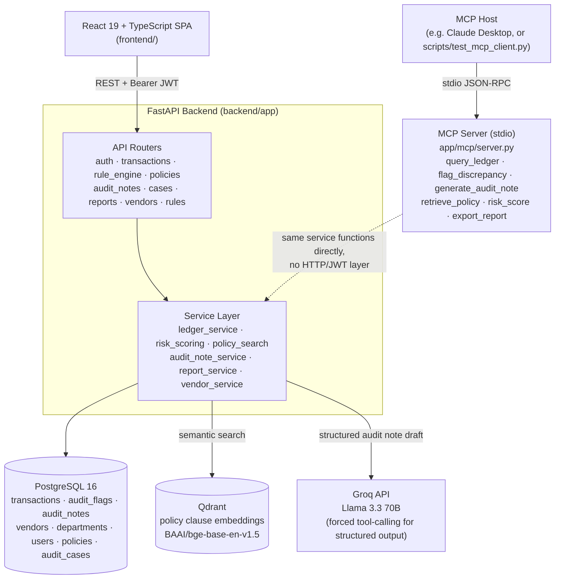

# Audit Trail Q&A System

**An AI-assisted audit support tool that helps internal finance and compliance teams review flagged transactions, ground findings in real regulatory policy text, and route them through a human approval workflow.**


---

## Overview

Auditors and finance teams reviewing a transaction ledger for anomalies — duplicate payments, structuring, inactive-vendor payouts, missing approvals — traditionally do it manually: scan spreadsheets, cross-reference internal policy PDFs by hand, and write up findings from scratch. It's slow, inconsistent between reviewers, and hard to prove a finding was actually grounded in the right regulatory clause rather than a reviewer's memory of one.

This system automates the first pass. A rule engine scores every transaction against ten configurable heuristics (duplicate detection, threshold violations, structuring, inactive vendors, and more) and denormalizes a risk score onto each row. For anything flagged, an LLM drafts a structured audit note — summary, reasoning, risk assessment, recommended action — grounded in real RBI Master Direction policy text retrieved via semantic search, with every citation defensively checked against what was actually retrieved before it's shown to a human. That draft then moves through a real review workflow (draft → submitted → approved/rejected) gated by role, not just a status label nobody enforces.

What makes this more than a CRUD app: the same service layer backs both a REST API (for the React frontend) and an MCP server exposing the identical operations as tools an LLM host can call directly — so `query_ledger`, `generate_audit_note`, and `risk_score` aren't reimplemented twice, they're the same functions. Retrieval is enriched with ancestor clause-heading context at embed time (a terse clause like 6.2.1 shares almost no vocabulary with a natural-language query; its parent heading does) rather than plain fixed-size chunking. And the review workflow is a real state machine with backend-enforced role gates (`Auditor`/`Admin` can submit, `Finance Manager`/`Admin` can approve or reject), not just a status field anyone can flip.

## Architecture



The MCP server doesn't wrap the HTTP API — it imports and calls the same `app/services/*.py` functions the routers do, so there's exactly one implementation of "search the ledger" or "generate an audit note," not two that could drift apart.

## Key Features

### Rule-based risk engine — 10 rules
Nine per-transaction rules feed a denormalized `risk_score`/`risk_level` on each transaction (≥75 Critical, ≥50 High, ≥25 Medium, ≥1 Low), plus one population-level check:

| Rule | Points | What it catches |
|---|---|---|
| Duplicate detection | 40 | Same vendor + department + amount within a configurable window (default 24h) |
| Threshold violation | 30 | Amount exceeds a configurable limit (default $10,000) |
| Split payment / structuring | 35 | ≥3 payments to the same vendor within 72h summing at/above the threshold while each stays under it |
| Vendor–account mismatch | 15 | Transaction's account number doesn't match the vendor's on-file bank account |
| Missing approval | 20 | Status is Approved/Cleared but no approver is recorded |
| Inactive vendor | 20 | Vendor is marked inactive — verified live to genuinely re-flag on the next evaluation, not retroactively |
| Weekend/holiday transaction | 10 | Dated on a weekend or a configured holiday |
| Debit/credit mismatch | 10 | A vendor payment recorded as CREDIT instead of DEBIT |
| Round-number detection | 5 | Amount is an exact multiple of $100 |
| Benford's Law analysis | — | Chi-square test on leading-digit distribution across a whole `evaluate-all` batch — a statistical property of a *sample*, not a single transaction, so it's reported separately rather than folded into any one row's score |

### Hybrid retrieval RAG over real regulatory text
Three real RBI Master Direction PDFs, chunked by their actual clause structure (e.g. `4.1.5`) rather than fixed-size windows:
- *Master Direction – Fraud Risk Management (Commercial Banks), 2024*
- *Master Direction – Fraud Risk Management (NBFCs), 2024*
- *Master Direction – Know Your Customer (KYC), 2016*

Embedded with `BAAI/bge-base-en-v1.5` into Qdrant. A terse operative clause often shares no vocabulary with how someone actually asks about it (clause 6.2.1 never says "report"; its parent heading, "Reporting Incidents of Fraud to RBI," does) — so the text handed to the embedder is enriched with ancestor clause headings and chapter labels, while the stored/returned `content` stays the clean original text.

### Grounded audit note generation
`POST /transactions/{id}/generate-audit-note` retrieves the transaction's open rule findings plus the top-8 relevant policy clauses, then asks Groq's Llama 3.3 70B (via forced tool-calling for structured output, not free-text parsing) to draft a summary, reasoning, risk assessment, and recommended action. Citations are defensively filtered to only policy IDs actually present in the retrieved context — the model is never trusted not to hallucinate one — with a regex backstop that reconciles policy IDs the model discusses in free-text reasoning but leaves out of its structured citation list (a documented Llama reliability gap versus Claude's schema-enforced outputs).

### Human review workflow
A real state machine, not just a status label:

```
DRAFT --submit--> SUBMITTED --approve--> APPROVED
                            --reject--> REJECTED
```
- **Submit**: `Auditor` or `Admin`
- **Approve / Reject**: `Finance Manager` or `Admin`

Enforced with `require_role()` on the backend and mirrored in the frontend (Audit Workspace only renders the actions a signed-in user's role can actually perform, rather than showing a button that 403s).

### Audit Notes list page
`GET /audit-notes` (optionally `?status=draft|submitted|approved|rejected`) lists every generated note across the whole ledger, not just one transaction at a time — the frontend page at `/audit-notes` adds a status filter and links each row straight into Audit Workspace, closing what had been an outstanding gap (there was previously no way to see "everything currently in Submitted" in one place).

### CSV reporting
`GET /reports/export` streams flagged transactions (risk level Medium and above) as CSV — vendor/department names, amount, risk score, and the latest audit note's status — filterable by date range, department, status, and risk level. Built with the standard library's `csv` module and `StreamingResponse` only, deliberately no PDF library (see [Roadmap](#known-limitations--roadmap)).

### Admin vendor management
`GET /vendors` / `PATCH /vendors/{id}` let an Admin toggle a vendor's active status — the app's first single-role (`Admin`-only) gate, everywhere else uses role pairs. Verified live, end to end, that toggling a vendor genuinely changes the *next* rule-engine evaluation for its transactions (not retroactively — already-computed risk scores don't change until re-evaluated).

### MCP server
Six tools (`query_ledger`, `flag_discrepancy`, `generate_audit_note`, `retrieve_policy`, `risk_score`, `export_report`) exposed over stdio via the MCP Python SDK's `FastMCP`, calling the exact same service functions the REST API uses. Verified against a real stdio client, not just in-process calls.

## Tech Stack

| Layer | Technology | Version |
|---|---|---|
| Backend framework | FastAPI | 0.115.0 |
| Backend language | Python | 3.13 |
| ORM / migrations | SQLAlchemy / Alembic | 2.0.35 / 1.18.5 |
| Database | PostgreSQL | 16 |
| Vector database | Qdrant | 1.11.4 (server), 1.11.3 (client) |
| Embeddings | sentence-transformers (`BAAI/bge-base-en-v1.5`) | 5.6.0 |
| PDF parsing | pdfplumber | 0.11.10 |
| LLM provider | Groq (Llama 3.3 70B) | SDK 1.5.0 |
| MCP server | MCP Python SDK (`FastMCP`) | 1.28.1 |
| Auth | PyJWT + passlib[bcrypt] | 2.13.0 / 1.7.4 |
| ASGI server | Uvicorn | 0.51.0 |
| Frontend framework | React | 19.2.7 |
| Frontend language | TypeScript | ~6.0.2 |
| Build tool | Vite | 8.1.1 |
| Styling | Tailwind CSS | 3.4.19 |
| Data fetching | TanStack React Query | 5.101.2 |
| Routing | React Router | 7.18.1 |
| HTTP client | Axios | 1.18.1 |
| Linting | oxlint | 1.71.0 |
| Containerization | Docker Compose (Postgres + Qdrant) | — |

## Screenshots

<!-- Drop real screenshots into docs/screenshots/ and update the paths below. -->


## Getting Started

### Prerequisites
- Python 3.13
- Node.js 18+
- Docker (for Postgres + Qdrant)
- A free [Groq API key](https://console.groq.com/keys)

### 1. Start Postgres and Qdrant

```bash
docker compose up -d
```

This brings up `postgres:16` (`audit_trail_db`, port 5432) and `qdrant/qdrant:v1.11.4` (ports 6333/6334), per `docker-compose.yml`.

### 2. Backend

```bash
cd backend
python -m venv venv

# Windows
venv\Scripts\activate
# macOS/Linux
source venv/bin/activate

pip install -r requirements.txt
cp .env.example .env
```

Edit `.env` and set:
- `JWT_SECRET_KEY` — generate one with `python -c "import secrets; print(secrets.token_hex(32))"`
- `GROQ_API_KEY` — from [console.groq.com/keys](https://console.groq.com/keys)

Then run migrations and seed data:

```bash
alembic upgrade head
python scripts/seed_users.py          # Auditor / Finance Manager / Admin test accounts
python scripts/seed_transactions.py   # ~288 synthetic transactions with deliberate anomalies
python scripts/ingest_policies.py     # chunks + embeds the 3 RBI PDFs into Qdrant
uvicorn app.main:app --reload --port 8000
```

`seed_users.py` creates one account per role, all with password `ChangeMe123!` — dev/testing only.

### 3. Frontend

```bash
cd frontend
npm install
npm run dev
```

Vite serves on `http://localhost:5173`; it points at `http://localhost:8000/api/v1` by default (`VITE_API_BASE_URL`, see `frontend/.env.example`).

### 4. (Optional) MCP server

```bash
cd backend
python -m app.mcp.server
```

Runs over stdio — spawn it from an MCP host, or see `scripts/test_mcp_client.py` for a real client example.

## API Overview

All routes are under `/api/v1` and require a Bearer JWT except login. Only `PATCH /vendors/{id}` requires the `Admin` role specifically — every other endpoint is open to any authenticated role (viewing isn't restricted; only the review workflow and vendor toggle are role-gated).

| Resource | Endpoints |
|---|---|
| **Auth** | `POST /auth/login`, `GET /auth/me` |
| **Transactions / Ledger** | `GET /transactions` (filter, sort, paginate), `GET /transactions/{id}` |
| **Rule Engine** | `POST /transactions/{id}/evaluate`, `POST /transactions/evaluate-all`, `GET /transactions/{id}/flags` |
| **Policies (RAG)** | `POST /policies/search`, `GET /policies/by-ids` |
| **Audit Notes** | `POST /transactions/{id}/generate-audit-note`, `GET /transactions/{id}/audit-note`, `GET /audit-notes` (optionally filtered by status), `POST /audit-notes/{id}/submit`, `POST /audit-notes/{id}/approve`, `POST /audit-notes/{id}/reject` |
| **Case Library** | `GET /cases` |
| **Reports** | `GET /reports/export` (CSV, filterable) |
| **Vendors (Admin)** | `GET /vendors`, `PATCH /vendors/{id}` *(Admin only)* |
| **Rules** | `GET /rules` |

## Known Limitations / Roadmap

Pulled directly from the project's own tracked backlog — real, currently-true gaps, not aspirational:

- **`retrieve_similar_cases` doesn't exist** — the Case Library's `audit_cases` table exists but is empty, and the semantic similar-case retrieval it needs (embeddings, a Qdrant collection) hasn't been built.
- **PDF export isn't built** — reports and audit notes are only exportable as CSV (`GET /reports/export`); the original requirements also ask for PDF.
- **No user or department management** — the Admin Panel covers vendors and the rule overview only; there's no `GET /users` at all, so a live user count isn't shown anywhere.
- **Rejection reason has no dedicated column** — it's appended as text into the note's `content` field rather than stored separately; the frontend splits it back out for display, but the backend storage gap is unfixed.
- **MCP server has no auth/identity layer** — it's a stdio-only trust model (the host process is the trust boundary); not safe to expose over a network transport as-is.
- **No automated test suite yet** — every feature has been verified manually/live per session rather than via unit or integration tests.
- **`generate_audit_note` has no idempotency check** — calling it twice for the same transaction creates two note rows; the read path always shows the most recent one, but duplicates aren't cleaned up automatically.

## License & Contributors

Licensed under the [MIT License](LICENSE).

Built by **Varun Patel**. Developed with AI-assisted tooling ([Claude Code](https://claude.com/claude-code)).
